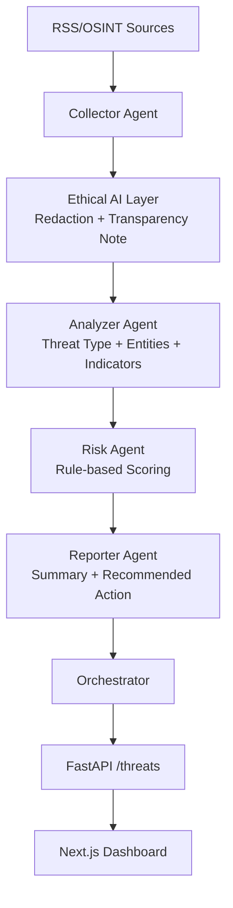

# 🚨 AI Threat Intelligence Agent (OSINT)

## 📌 Overview
This project is an AI-driven threat intelligence system designed to automate open-source intelligence (OSINT) monitoring and risk assessment. It transforms unstructured public data into actionable business insights using a hybrid NLP and agent-based architecture.

The system simulates a real-world cyber intelligence pipeline by ingesting external data sources, detecting potential threats, assigning risk levels, and generating explainable summaries for decision-makers.

---

## 🧠 Key Features

- 🌍 OSINT data ingestion (RSS feeds, external sources)
- 🔍 NLP-based threat detection and entity extraction
- 🤖 Agentic AI pipeline for modular decision-making
- ⚠️ Risk scoring engine with confidence levels
- 📊 Business-friendly intelligence summaries
- ⚖️ Ethical AI layer (transparency, bias mitigation, explainability)
- ⚛️ Full-stack implementation (FastAPI + Next.js)

---

## 🏗️ Architecture

The system follows a modular, agent-based design:

- **Collector Agent**
  - Fetches and preprocesses OSINT data from external sources

- **Analyzer Agent**
  - Applies NLP techniques and LLM reasoning to detect threats and extract key entities

- **Risk Agent**
  - Evaluates severity using rule-based scoring and assigns risk levels

- **Reporter Agent**
  - Generates human-readable summaries and recommended actions

- **Orchestrator**
  - Coordinates agent interactions and manages data flow across the pipeline

### Agent Flow Diagram



---

## ⚙️ Tech Stack

### Backend
- Python
- FastAPI
- pandas
- spaCy (optional NLP layer)
- OpenAI API (LLM reasoning)

### Frontend
- Next.js (React)
- Axios / Fetch API

### Data Sources
- RSS feeds (e.g. cybersecurity news)
- Mocked OSINT inputs (for testing)

---

## 🔄 System Workflow

1. **Data Ingestion**
   - Collects OSINT data from RSS feeds or APIs

2. **Threat Analysis**
   - Extracts entities and identifies threat patterns using NLP + LLMs

3. **Risk Assessment**
   - Assigns risk levels based on severity, frequency, and context

4. **Reporting**
   - Generates business-friendly summaries and recommendations

5. **Output**
   - Returns structured, explainable results via API and dashboard

---

## 📊 Example Output

```json
{
  "source": "Cyber News",
  "threat": "Phishing attack targeting financial sector",
  "risk_level": "High",
  "confidence": 0.87,
  "summary": "A phishing campaign is targeting financial institutions...",
  "recommendation": "Increase monitoring of authentication systems"
}
